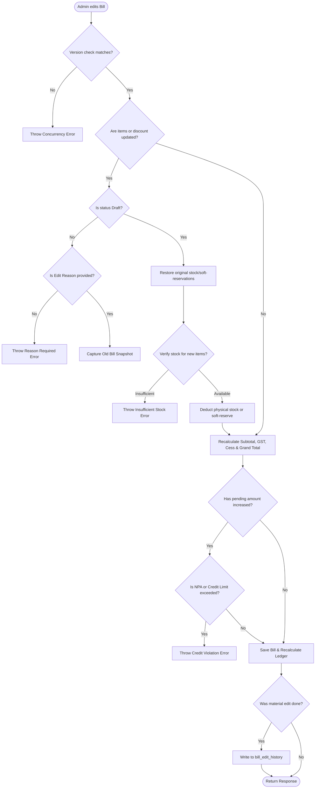

# FMCG Shop: Core Billing Module Flows & Features

This document serves as a comprehensive reference for the operational flows, features, and database lifecycles of the **Billing Module** in the FMCG Shop application. It details how invoices are created, modified, returned, cancelled, and how they impact the **Inventory (Stock Batches)**, **Customer Ledger (Khata)**, and **Delivery system**.

---

## 1. Overview of Billing Modes & Lifecycles

The application supports five distinct billing/payment states. Each mode affects stock levels, accounting ledger entries, and delivery assignments differently.

| Payment Mode | Initial Bill Status | Stock Impact | Khata Impact | Delivery Assignment |
| :--- | :--- | :--- | :--- | :--- |
| **CASH / UPI** | `PAID` | Deducted immediately | None (`pending = 0.00`) | Counter pickup |
| **UDHAR (Credit)** | `CONFIRMED` | Deducted immediately | Outstanding increases by `grandTotal` | Counter pickup |
| **PARTIAL** | `PARTIAL` | Deducted immediately | Outstanding increases by `pendingAmount` | Counter pickup |
| **COD** | `COD_PENDING` | Deducted immediately | Outstanding increases by `grandTotal` | Dispatched to Delivery Boy |
| **DRAFT** | `DRAFT` | Soft-reserved only | None (ledger unchanged) | None |

---

## 2. Detailed Transactional Flows

### A. Direct Spot Payments (Cash & UPI)
Used when a customer pays the full amount immediately at the counter at the time of checkout.

1. **Creation (`createBill`)**:
   - Subtotal, GST, Cess, and discounts are calculated.
   - `paidAmount` is set to the full `grandTotal`.
   - `pendingAmount` is set to `0.00`.
   - Bill status is marked as `PAID`.
2. **Stock Impact**:
   - Stock is immediately deducted from the selected or FIFO batch.
   - A `logMovement` entry with type `SALE` is generated.
3. **Khata Impact**:
   - Recalculates customer pending balance (`totalPending`), which remains unchanged since there is no pending amount.
4. **Dashboard Impact**:
   - Today's sales revenue increases by the `grandTotal`.
   - Today's Cash/UPI collections increase by the `grandTotal`.

---

### B. UDHAR (Store Credit / Udhar Sales)
Used when a customer purchases goods on store credit (Udhar).

1. **Creation & Validation**:
   - Check if the customer is marked as **NPA** (Non-Performing Asset). If yes, credit sales are blocked.
   - Check if the customer's projected outstanding balance (`totalPending + grandTotal`) exceeds their **Effective Credit Limit**. If yes, the transaction is blocked.
   - `paidAmount` = `0.00`.
   - `pendingAmount` = `grandTotal`.
   - Status transitions to `CONFIRMED`.
2. **Stock Impact**:
   - Stock is physically deducted immediately from inventory batches.
3. **Khata Impact**:
   - Customer's outstanding balance (`totalPending`) increases by the `grandTotal`.
4. **Dashboard Impact**:
   - Today's Revenue += `grandTotal`.
   - Today's New Udhar += `grandTotal`.

---

### C. PARTIAL Payment Mode
Used when a customer makes a partial cash down-payment at checkout and holds the remaining balance on store credit (Udhar).

1. **Creation & Validation**:
   - Requires `paidAmount` to be positive and less than or equal to `grandTotal`.
   - Checks NPA status and credit limit block on the remaining `pendingAmount`.
   - `pendingAmount` is calculated as `grandTotal - paidAmount`.
   - Status transitions to `PARTIAL`.
2. **Stock Impact**:
   - Stock is physically depleted from inventory batches immediately.
3. **Khata Impact**:
   - Customer's outstanding balance (`totalPending`) is increased by the `pendingAmount`.
4. **Dashboard Impact**:
   - Today's Revenue += `grandTotal`.
   - Today's New Udhar += `pendingAmount`.
   - Today's Cash Collection += `paidAmount`.

---

### D. COD (Cash On Delivery) Flow
Used for orders delivered directly to the customer's shop where payment is collected by the delivery agent.

#### Phase 1: Order Booking & Dispatch
1. **Booking**: The cashier creates the bill with `PaymentMode = COD`.
   - `paidAmount` = `0.00`, `pendingAmount` = `grandTotal`.
   - Status transitions to `COD_PENDING`.
   - Stock is immediately depleted from the batch (so items are reserved for delivery).
   - Customer's outstanding balance (`totalPending`) increases by `grandTotal`.
2. **Dispatch**:
   - Admin assigns the bill to a delivery agent (`assignDelivery`), creating a `Delivery` record.
   - When the agent marks the status as `OUT` (Out for Delivery), the bill status changes to `COD_DELIVERED` and a 4-digit OTP is triggered to the customer via WhatsApp.

#### Phase 2: Settlement (Fulfillment)
The delivery agent collects the payment and confirms it in the mobile app:
* **Option 1: Customer Pays (Cash/UPI)**:
  - Agent enters the customer OTP and marks the delivery as `COD_COLLECTED`.
  - A payment record is created in the database.
  - Bill `paidAmount` becomes `grandTotal`, `pendingAmount` becomes `0.00`, and bill status transitions to `COD_COLLECTED`.
  - Customer's outstanding balance (`totalPending`) decreases by the collected amount.
* **Option 2: Customer defaults to Store Credit (Udhar)**:
  - If the customer cannot pay at the door, the delivery status is marked as `COD_DEFAULTED` (Delivery Boy defaults it).
  - The bill's payment mode is changed to `UDHAR`, and status to `CONFIRMED`.
  - `paidAmount` remains `0.00`, `pendingAmount` remains `grandTotal`.
  - Customer's ledger balance remains outstanding but is officially converted to store credit (Udhar).

---

### E. Draft Order / Booking Flow (Order Booking)
Allows salesmen or cashiers to log orders when stock is scarce or customer visits are pending confirmation, without committing them to the ledger.

1. **Booking**:
   - Created with status = `DRAFT`.
   - Checks stock availability. Instead of physical deduction, the quantities are **soft-reserved** (`secondarySoftReserved` is increased in the stock batch records).
   - Customer pending balance (`totalPending`) is **not** affected.
   - Credit limit validations are skipped (since the transaction isn't finalized).
2. **Confirmation (`confirmBill`)**:
   - Admin or manager confirms the draft order.
   - Customer NPA status and credit limits are validated.
   - Releases the `secondarySoftReserved` quantities and performs physical stock deductions (`deductByPrimary` / `deductBySecondary`).
   - Customer's `lastOrderAt` is updated.
   - Recalculates customer pending balance and changes bill status dynamically (`PAID`, `PARTIAL`, or `CONFIRMED` based on payments).

---

## 3. Return, Cancellation & Restoring Flows

### A. Sales Return Flow (`returnItems`)
Handles instances where a customer returns individual items from a bill.

1. **Input Validation**:
   - Returns on cancelled bills are blocked.
   - Quantity to return cannot exceed the originally sold quantity for each item.
2. **Inventory Restoration**:
   - Quantities returned are added back to the specific batch's `secondary_remaining` and overall stock.
   - A stock movement log of type `RETURN_IN` is recorded.
3. **Refund Adjustments**:
   - The bill's `subtotal`, `gstTotal`, and `cessTotal` are reduced by proportional values calculated at the line-item level.
   - The returned value is first subtracted from the invoice's `pendingAmount`.
   - If the return value is greater than the outstanding debt (`pendingAmount`), the remainder is subtracted from `paidAmount` (reflecting cash/UPI returned to the customer).
4. **Ledger Recalculation**:
   - Recalculates the customer's `totalPending` balance, reducing it by the amount deducted from the bill's `pendingAmount`.
5. **Auto-Cancellation**:
   - If all items in a bill are returned (quantity of all items becomes `0`), the bill status is automatically set to `CANCELLED`.

---

### B. Bill Cancellation Flow (`cancelBill`)
Used to void a bill completely.

* **For DRAFT Bills**:
  - Releases soft reservations (`secondarySoftReserved` is decreased).
  - Bill status is set to `CANCELLED`.
* **For CONFIRMED / PAID / PARTIAL Bills**:
  - Restores physical stock back to its original batch (`addBackStockToBatch`).
  - Bill status is set to `CANCELLED`.
  - Recalculates customer pending balance, removing any unpaid pending debt from the customer's ledger.

---

### C. Bill Restoring Flow (`restoreBill`)
Restores a previously cancelled bill back to active.

1. **Validation**:
   - Checks customer NPA status and credit limit blocks.
   - Validates physical stock availability for all items since inventory levels might have changed while the bill was cancelled.
2. **Stock Deduction**:
   - Re-deducts physical stock from batches.
3. **Re-Activation**:
   - Re-calculates bill status dynamically based on paid vs pending amount.
   - Customer ledger balance (`totalPending`) is recalculated.

---

## 4. Bill Modification & Audit Logging

Admin or Manager users can update a bill's items, payment mode, discount, notes, and paid amounts.

### Key Editing Features:
1. **Optimistic Locking**:
   - The request contains a `version` field. If the DB record version doesn't match, the transaction fails to prevent concurrent updates from overwriting edits.
2. **Price Override Protection**:
   - If edited by a salesman/delivery agent, the custom rate cannot be set lower than the base product buy price (cost limit).
3. **Ledger Auditing**:
   - Modifying items/discounts on a confirmed bill requires an `editReason`.
   - Snapshot of old state and new state is stored in `bill_edit_history` as JSON logs for audit compliance.

---

## 5. Summary of Math & Rounding Logic

To prevent rounding issues (such as tax mismatches and fractions of a paisa), the system uses the following calculations:

* **GST Divisor Method**:
  $$TaxDivisor = 1 + \frac{GstPercent + CessPercent}{100}$$
  
* **Subtotal Calculation**:
  $$ItemTotal = InclusivePrice \times Quantity$$
  $$ItemSubtotal = \frac{ItemTotal}{TaxDivisor} \text{ (Rounded to 2 decimal places)}$$
  
* **Tax Calculations**:
  $$GstAmount = ItemSubtotal \times GstPercent \text{ (Rounded to 2 decimal places)}$$
  $$CessAmount = ItemSubtotal \times CessPercent \text{ (Rounded to 2 decimal places)}$$
  
* **Adjustment Factor**:
  If $ItemSubtotal + GstAmount + CessAmount \neq ItemTotal$, the difference is adjusted into the $GstAmount$ to ensure the exact matching of invoices at the line-item level.
